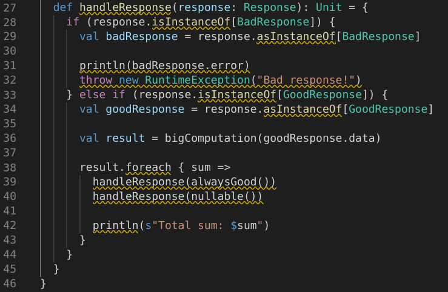
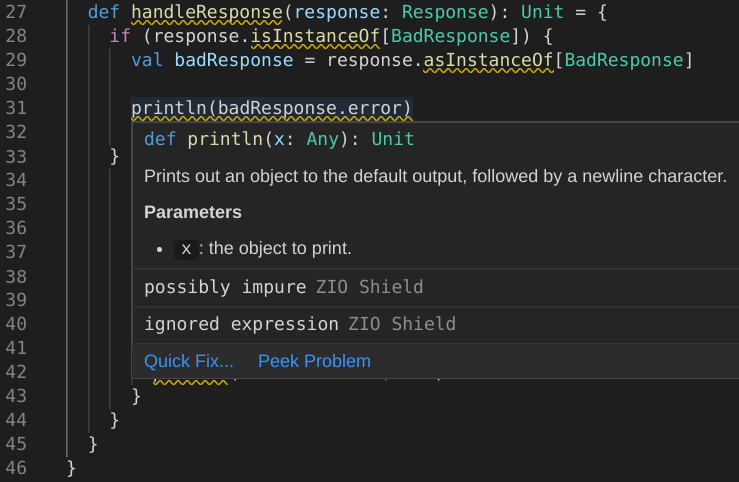

# ZIO Shield :shield:

| Project Stage                         |
| ------------------------------------- |
| [![Project stage][Stage]][Stage-Page] |

[](https://travis-ci.com/vovapolu/zio-shield)

ZIO Shield statically analyses the source code, enforcing best coding practices with ZIO.  
It aims to keep your code _pure_, _total_ and _clean_ with the help of powerful ZIO ecosystem. 

Powered by [Scalafix](https://scalacenter.github.io/scalafix/) and [Scalazzi rules](https://github.com/scalaz/scalazzi).

## Installation 

### sbt
Add `zio-shield` sbt plugin to your `project/plugins.sbt`:
```sbt
addSbtPlugin("dev.zio" % "zio-shield" % "0.1.0")
```

It will add `semanticdb-scalac` compiler plugin and `-Yrangepos` scalac option 
to your project settings if they doesn't exist. 
They are needed to generate [SemanticDb](https://scalameta.org/docs/semanticdb/guide.html) 
files for static analysis.  

#### Usage

Running `shield` command will start the analysis. 
```
> shield
[warn] ZioShieldShowcase.scala:23:7: error: possibly nullable
[warn]   def nullable(): Response = {
[warn]       ^^^^^^^^
[warn] ZioShieldShowcase.scala:24:18: error: nullable: null usage
[warn]     GoodResponse(null)
[warn]                  ^^^^
[warn] ZioShieldShowcase.scala:27:7: error: possibly nullable
[warn]   def handleResponse(response: Response): Unit = {
[warn]       ^^^^^^^^^^^^^^
[warn] ZioShieldShowcase.scala:40:24: error: possibly nullable
[warn]         handleResponse(nullable())
[warn]                        ^^^^^^^^
[warn] ZioShieldShowcase.scala:27:7: error: possible partial symbol
[warn]   def handleResponse(response: Response): Unit = {
[warn]       ^^^^^^^^^^^^^^
[warn] ZioShieldShowcase.scala:32:7: error: not total: throwing exceptions
[warn]       throw new RuntimeException("Bad response!")
[warn]       ^^^^^^^^^^^^^^^^^^^^^^^^^^^^^^^^^^^^^^^^^^^
[warn] ZioShieldShowcase.scala:28:18: error: type casting
[warn]     if (response.isInstanceOf[BadResponse]) {
[warn]                  ^^^^^^^^^^^^
[warn] ZioShieldShowcase.scala:29:34: error: type casting
[warn]       val badResponse = response.asInstanceOf[BadResponse]
[warn]                                  ^^^^^^^^^^^^
[warn] ZioShieldShowcase.scala:34:35: error: type casting
[warn]       val goodResponse = response.asInstanceOf[GoodResponse]
[warn]                                   ^^^^^^^^^^^^
[warn] ZioShieldShowcase.scala:39:9: error: ignored expression
[warn]         handleResponse(alwaysGood())
[warn]         ^^^^^^^^^^^^^^^^^^^^^^^^^^^^
[warn] ZioShieldShowcase.scala:40:9: error: ignored expression
[warn]         handleResponse(nullable())
[warn]         ^^^^^^^^^^^^^^^^^^^^^^^^^^
[warn] ZioShieldShowcase.scala:8:7: error: Future returning method
[warn]   def bigComputation(data: String): Future[Int] = Future {
[warn]       ^^^^^^^^^^^^^^
...
```

`ZioShieldShowcase.scala` source code located [here](shield-api/src/test/scala/zio/shield/rules/examples/ZioShieldShowcase.scala).

#### Configuration

You can set `shieldFatalWarnings` sbt setting to make all warnings fatal,
blocking you build if there are any problems detected by ZIO Shield. 
```sbt
shieldFatalWarnings := true
```
```
> shield
[error] ZioShieldShowcase.scala:23:7: error: possibly nullable
[error]   def nullable(): Response = {
[error]       ^^^^^^^^
...
```

To exlude specific [rules](#rules) from analysis you can create `.shield.yaml` file in the project root and specify `exludedRules` option. 
```yaml
# .shield.yaml
excludedRules: [ZioShieldNoIgnoredExpressions]
```

### metals
For using ZIO Shield with metals you should provide custom version of metals language server. 

In vscode it can be done in your `settings.json`:
```json
  "metals.customRepositories": ["central", "bintray:vovapolu/maven"],
  "metals.serverVersion": "0.7.6-zio-shield-RC0"
```
And then run `Metals: Restart server` command or just restart the editor.






#### Troubleshooting

- **Warnings are not shown**

  Run `Metals: Import build` in vscode. If it doesn't help restart the editor and try again. 

## Rules 
- `ZioShieldNoFutureMethods` blocks any `val` or `def` that has type of `Future[...]`
- `ZioShieldNoIgnoredExpressions` blocks ignored expressions except in `ZIO.effect*` blocks 
- `ZioShieldNoReflection`  blocks all methods from `scala.reflect`, `java.lang.reflect` and `java.lang.Class`
- `ZioShieldNoTypeCasting`  blocks `asInstanceOf`, `isInstanceOf` and any `case x: Y` except in `ZIO.effect*` blocks
- `ZioShieldNoImpurity`  blocks direct usages of `Unit` returning methods and indirect usages through other methods except in `ZIO.effect*` blocks
- `ZioShieldNoIndirectUse`  blocks "effectful" methods, which contain usages of `ZIO.effect*`, 
expect when they are defined in ancestors of "pure" traits, i.e. traits without methods that use `ZIO.effect*`.
- `ZioShieldNoNull` blocks direct `null` usages and indirect usages through other methods except in `ZIO.effect*` blocks
- `ZioShieldNoPartial` blocks direct `throw` and `try {...} catch ...` usages and indirect usages through other methods except in `ZIO.effect*` blocks


[Stage]: https://img.shields.io/badge/Project%20Stage-Experimental-yellow.svg
[Stage-Page]: https://github.com/zio/zio/wiki/Project-Stages
